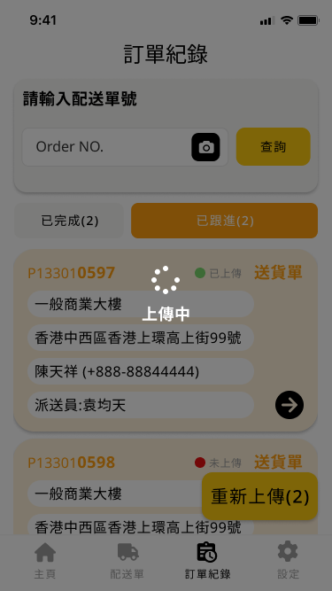
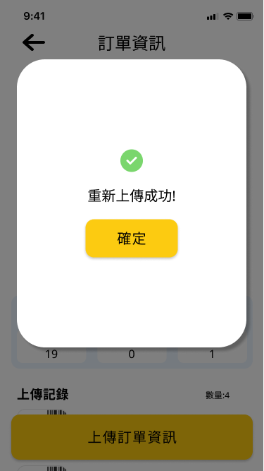

<head>
  <link rel="stylesheet" href="assets/css/styles.css">
</head>

- [First TMS 操作手冊](#first-tms-操作手冊)
  - [簡介](#簡介)
  - [安裝指南](#安裝指南)
- [First TMS 使用步驟](#first-tms-使用步驟)
  - [步驟 1：開啟應用程式](#步驟-1開啟應用程式)
  - [步驟 2：登入](#步驟-2登入)
  - [步驟 3：進入主頁頁面](#步驟-3進入主頁頁面)
- [First TMS 主頁操作步驟](#first-tms-主頁操作步驟)
  - [步驟 1：進入主頁頁面](#步驟-1進入主頁頁面)
  - [步驟 2：主頁頁面介紹](#步驟-2主頁頁面介紹)
  - [步驟 3：更新運輸單](#步驟-3更新運輸單)
  - [步驟 4：查看運輸單](#步驟-4查看運輸單)
  - [步驟 5：開始新增配送單](#步驟-5開始新增配送單)
- [First TMS 新增配送單操作步驟](#first-tms-新增配送單操作步驟)
  - [步驟 1：進入新增配送單頁面](#步驟-1進入新增配送單頁面)
  - [步驟 2：新增配送單頁面介紹](#步驟-2新增配送單頁面介紹)
  - [步驟 3：新增配送單](#步驟-3新增配送單)
    - [新增配送單](#新增配送單)
    - [刪除配送單](#刪除配送單)
  - [步驟 4：開始配送](#步驟-4開始配送)
- [First TMS 配送單操作步驟](#first-tms-配送單操作步驟)
  - [步驟 1：進入配送單頁面](#步驟-1進入配送單頁面)
  - [步驟 2：查看配送單訊息](#步驟-2查看配送單訊息)
  - [步驟 3：查詢配送單號](#步驟-3查詢配送單號)
  - [步驟 4：處理配送單](#步驟-4處理配送單)
- [First TMS 配送單訂單資訊操作步驟](#first-tms-配送單訂單資訊操作步驟)
  - [步驟 1：進入訂單資訊頁面](#步驟-1進入訂單資訊頁面)
  - [步驟 2：訂單資訊頁面介紹](#步驟-2訂單資訊頁面介紹)
  - [步驟 3：查看訂單狀態](#步驟-3查看訂單狀態)
  - [步驟 4：核對序列號](#步驟-4核對序列號)
    - [核對序列號](#核對序列號)
    - [刪除序列號](#刪除序列號)
  - [步驟 5：查看送貨/託收單資訊](#步驟-5查看送貨託收單資訊)
  - [步驟 6：上傳圖片](#步驟-6上傳圖片)
  - [步驟 7：更新訂單狀態](#步驟-7更新訂單狀態)
    - [完成訂單](#完成訂單)
    - [跟進訂單](#跟進訂單)
    - [取消訂單](#取消訂單)
  - [步驟 8：處理錯誤提示](#步驟-8處理錯誤提示)
- [First TMS 訂單紀錄操作步驟](#first-tms-訂單紀錄操作步驟)
  - [步驟 1：進入訂單紀錄頁面](#步驟-1進入訂單紀錄頁面)
  - [步驟 2：查看訂單紀錄](#步驟-2查看訂單紀錄)
  - [步驟 3：查詢配送單號](#步驟-3查詢配送單號-1)
  - [步驟 4：重新上傳訂單資訊](#步驟-4重新上傳訂單資訊)
- [First TMS 設定頁面操作步驟](#first-tms-設定頁面操作步驟)
  - [步驟 1：進入設定頁面](#步驟-1進入設定頁面)
  - [步驟 2：查看帳號資訊](#步驟-2查看帳號資訊)
  - [步驟 3：清除暫存](#步驟-3清除暫存)
  - [步驟 4：登出帳號](#步驟-4登出帳號)

***

# First TMS 操作手冊

  

* **版本 :** 1.0
* **公司名稱 :** Supply First Technologies Limited 宏泰天一科技有限公司

***

<!-- # 目錄
1. [簡介](#簡介)
2. [安裝指南](#安裝指南)｛
3. [主要應用模塊](#主要應用模塊)
   1. [First TMS 使用步驟](#first-tms-使用步驟)
   2. [First TMS 主頁操作步驟](#first-tms-主頁操作步驟)
      1. [進入主頁頁面](#步驟-1進入主頁頁面) 
      
   3. [First TMS 新增配送單操作步驟](#first-tms-新增配送單操作步驟)
   4. [First TMS 配送單操作步驟](#first-tms-配送單操作步驟)
   5. [First TMS 配送單訂單資訊操作步驟](#first-tms-配送單訂單資訊操作步驟)
   6. [First TMS 訂單紀錄操作步驟](#first-tms-訂單紀錄操作步驟)
   7. [First TMS 設定頁面操作步驟](#first-tms-設定頁面操作步驟) 

***

-->

## 簡介

歡迎使用 First TMS 物流管理系統。本手冊旨在幫助您快速了解和掌握 First TMS 的各項功能及操作步驟，從而提高您的物流管理效率。First TMS 提供了一個直觀且高效的平台，讓您可以輕鬆管理配送單、跟蹤訂單狀態、設定個人偏好等。

本手冊涵蓋以下主要模塊：
- 登入操作步驟
- 新增配送單
- 配送單訊息操作
- 訂單紀錄操作
- 設定頁面操作

我們將詳細介紹每個模塊的使用方法，並提供相應的圖片說明，讓您可以直觀地理解和應用各項操作。

***

## 安裝指南

<table>
  <tr>
    <th style="background-color: #F5F5DC;">Platform</th>
    <th style="background-color: #F5F5DC;">QR Code</th>
  </tr>
  <tr>
    <td style="background-color: #FFEBEE;">iOS</td>
    <td style="background-color: #FFEBEE;">
      
    </td>
  </tr>
  <tr>
    <td style="background-color: #E3F2FD;">Android</td>
    <td style="background-color: #E3F2FD;">
      
    </td>
  </tr>
</table>

***

# First TMS 使用步驟

## 步驟 1：開啟應用程式
1. 在您的移動設備上，找到並打開 First TMS 應用程式。

## 步驟 2：登入
1. 您將看到如下圖所示的登入頁面：

  

2. 在「使用者 ID」欄位中輸入您的使用者 ID。
3. 在「密碼」欄位中輸入您的密碼。
4. 輸入完成後，點擊頁面底部的黃色「登入」按鈕。

## 步驟 3：進入主頁頁面
1. 系統將驗證您的使用者 ID 和密碼。
2. 驗證成功後，您將進入 First TMS 的主頁面，開始使用應用程式的各項功能。

***

# First TMS 主頁操作步驟

## 步驟 1：進入主頁頁面
1. 登入成功後，您將進入主頁面。主頁面如下圖所示：

   

## 步驟 2：主頁頁面介紹
1. 總共區分三個模塊:
   - 「登入資訊」
   - 「資料同步時間與更新按鈕」
   - 「運輸單清單」

請確保帳號名稱，以及右上角用戶圖示正確，如果顯示綠燈表示當前網路狀態正常。

## 步驟 3：更新運輸單
1. 當 App 登入後，我們會進行數據同步動作，並且顯示最後一次同步日期與時間，您也可以手動點擊，右邊「更新」按鈕 

2. 點擊更新按鈕以更新您的運輸單信息。更新過程中顯示如下：

   

3. 更新完成後，系統會顯示更新結果。
   - 若更新成功，會顯示「資料已更新！」提示。

   

   - 若更新失敗，會顯示「資料更新失敗！」提示。

   

## 步驟 4：查看運輸單
1. 主頁面會顯示您的運輸單列表，包括每張運輸單的詳細信息和狀態。
   - 顯示運輸單號:`XCSHKLFSA240240400299` 
   - 車號:`XC9999`
   - 時間段:`9AM-12PM`
   - 配送單狀態

   

2. 滑動查看更多運輸單，若有多張運輸單，您可以左右滑動查看更多運輸單。
   - 如圖所示，左滑可查看下一張運輸單。

   

3. 如果帳號查無運輸單，系統會提示「查無運輸單」。請按提示重新登入其他帳號。

   

## 步驟 5：開始新增配送單
1. 點擊「新增配送單」按鈕以進入新增配送單頁面。

   

<!-- ## 注意事項
- **定時更新**：請定期更新您的運輸單信息，以確保資料的準確性。
- **處理提示信息**：根據系統提示的信息進行相應操作，確保運輸過程順利。

*** -->

# First TMS 新增配送單操作步驟

## 步驟 1：進入新增配送單頁面
1. 在主頁面上，點擊「新增配送單」按鈕以進入新增配送單頁面。

## 步驟 2：新增配送單頁面介紹
1. 總共區分三個模塊:
   - 「輸入配送單」
   - 「掃描紀錄」
   - 「配送單清單」

從「掃描紀錄」可以知道運輸單目前還有未掃描處理的配送單數量

   

## 步驟 3：新增配送單

### 新增配送單
1. 在「請輸入配送單號」欄位中輸入您的配送單號。
   - 您可以手動輸入單號或點擊相機圖標掃描條碼。
   - 例如，輸入單號 `P240401417`。
  
2. 點擊「查詢」按鈕，系統將開始查詢該配送單號的詳細信息。
   

3. 查詢成功後，系統將顯示該配送單號的詳細信息和掃描記錄。
   - 掃描記錄包括已掃描和待掃描的數量。
   - 例如，已掃描1件，待掃描19件。

   

4. 如果查無此張配送單，系統會提示「查無此張配送單。」。
   - 點擊「確定」關閉提示。

   

5. 如果配送單已存在，系統會提示「重複新增，配送單已存在！」。
   - 點擊「確定」關閉提示。

   

### 刪除配送單

1. 針對想要刪除的配送單進行 **左滑到底** 或 **左滑垃圾桶出現並點擊** 即可進行刪除。

   

## 步驟 4：開始配送
1. 驗證配送單詳細信息，包括地址和聯絡人信息。
   - 確認所有信息無誤後，點擊「開始派送」按鈕。

   

2. 如果存在未匹配的訂單，系統會彈出提示信息，請確認是否繼續派送。
   - 點擊「確定」繼續派送或「取消」返回。

   

3. 如果所有訂單已匹配成功，系統會提示「訂單已全數匹配成功！」。
   - 點擊「確定」完成操作。

   

<!-- ## 注意事項
- **確認輸入正確**：請確保輸入的配送單號無誤。
- **掃描條碼**：如果手動輸入不便，可以使用相機掃描條碼來自動填充配送單號。
- **處理提示信息**：根據系統提示的信息進行相應操作，確保配送過程順利。

*** -->

# First TMS 配送單操作步驟

## 步驟 1：進入配送單頁面
1. 在主頁面上，點擊底部導航欄的「配送單」圖標以進入配送單頁面。

## 步驟 2：查看配送單訊息
1. 進入配送單頁面後，系統將顯示訂單訊息內容。
   - 訂單狀態可以是「未完成」、「進行中」或其他狀態。
   - 訂單訊息涵蓋 :
     - **訂單類型**:「送貨單」、「託收單」
     - **資訊**:公司名稱、地址、聯繫人員姓名與電話

   - 您可以查看「未完成」和「進行中」的配送單。
   - 例如，顯示未完成的配送單：

   

   - 例如，顯示進行中的配送單：

   

2. 若尚無配送單記錄，系統會顯示「尚無記錄」。

   

## 步驟 3：查詢配送單號
1. 在「請輸入配送單號」欄位中輸入您的配送單號。
   - 您可以手動輸入單號或點擊相機圖標掃描條碼。
   - 例如，輸入單號 `P240401417`。

2. 點擊「查詢」按鈕，系統將開始查詢該配送單號的詳細信息
   
   

## 步驟 4：處理配送單
1. 在配送單列表中，點擊需要處理配送單進入**訂單資訊**頁面。

***

# First TMS 配送單訂單資訊操作步驟

## 步驟 1：進入訂單資訊頁面
1. 在配送單列表中，點擊需要處理配送單進入**訂單資訊**頁面。

## 步驟 2：訂單資訊頁面介紹
1. 總共區分六個模塊:
   - 「訂單資訊」
   - 「核對序列號」
   - 「送貨/託收單資訊」
   - 「上傳圖片」
   - 「序列號紀錄」
   - 「訂單狀態操作」
  

## 步驟 3：查看訂單狀態
1. 點擊訂單資訊右上方 「i」 按鈕，可以查看此張訂單完成資訊。
   - 例如，顯示開始託收和完成託收的時間。

   

   - 顯示開始送貨和完成送貨的時間。

   

## 步驟 4：核對序列號

### 核對序列號
1. 在送貨單資訊，存在「待掃描」數量不等於 0 時，我們可以進行核對序列號
   - 例如，顯示總數量13件，已掃描0件，待掃描2件。

2. 在「序列號」欄位中輸入您的訂單序列號，點擊「核對」按鈕。
   - 您可以手動輸入序列號或點擊相機圖標掃描條碼。
   - 例如，輸入序列號 `AA7R047`。
   輸入成功後會在序列號紀錄區域顯示剛輸入的序列號。
 
   

### 刪除序列號
1. 在序列號紀錄，針對想要刪除的序列號進行 **左滑到底** 或 **左滑垃圾桶出現並點擊** 即可進行刪除。

   
## 步驟 5：查看送貨/託收單資訊
1. 在查看送貨/託收單資訊，系統將顯示訂單的詳細信息和狀態。
   - 例如，顯示總數量13件，已掃描0件，待掃描2件。
   - 點擊「查看更多」按鈕，可以瀏覽所有產品資訊。
   

## 步驟 6：上傳圖片
1. 點擊「上傳圖片」按鈕，可以選擇從相簿或相機上傳圖片。

   

   - 選擇相簿上傳：

   

   - 選擇相機上傳：

   

2. 上傳成功後，圖片將顯示在訂單資訊下方。

   

## 步驟 7：更新訂單狀態

### 完成訂單
1. 當所有操作完成後，點擊「完成」按鈕。
2. 系統會提示確認是否完成訂單，點擊「確定」以完成訂單。

   

3. 如果所有操作成功，系統會提示「完成訂單」訊息。

   

4. 如果未完成所有掃描，系統會提示「未完成掃瞄所有序列號，完成訂單失敗！」。

   

### 跟進訂單
1. 若需跟進訂單，點擊「跟進」按鈕。
2. 系統會提示選擇跟進原因，例如「找不到客戶」、「拿錯貨物」、「產品損壞」或「其他原因」。

   

   - 如選擇「其他原因」，請輸入詳細原因。

   

3. 跟進完成後，系統會顯示「跟進訂單」訊息。

   

### 取消訂單
1. 若需取消訂單，點擊「取消」按鈕。
2. 系統會提示確認是否取消訂單，點擊「確定」以取消訂單。

   

## 步驟 8：處理錯誤提示
1. 如果連線失敗，系統會提示「連線失敗，請檢查連線狀態。」。

   

<!-- ## 注意事項
- **確認輸入正確**：請確保輸入的序列號無誤。
- **掃描條碼**：如果手動輸入不便，可以使用相機掃描條碼來自動填充序列號。
- **上傳圖片**：確保上傳的圖片清晰可辨識，方便後續核對和記錄。
- **處理提示信息**：根據系統提示的信息進行相應操作，確保訂單處理過程順利。

*** -->

# First TMS 訂單紀錄操作步驟

## 步驟 1：進入訂單紀錄頁面
1. 在主頁面上，點擊底部導航欄的「訂單紀錄」圖標以進入訂單紀錄頁面。

## 步驟 2：查看訂單紀錄
1. 進入訂單紀錄頁面後，系統將顯示訂單訊息內容。
   - 訂單狀態可以是「已完成」、「已跟進」或其他狀態。
   - 訂單訊息涵蓋 :
     - **訂單類型**:「送貨單」、「託收單」
     - **訂單同步狀態**:「未上傳」、「已上傳」
     - **資訊**:公司名稱、地址、聯繫人員姓名與電話、派送員資訊
    
    
    

2. 點擊「訂單卡片區域」 或「→」按鈕，可以查看訂單資訊，包括訂單開始和完成時間。
   
    
       

3. 若尚無訂單記錄，系統會顯示「尚無記錄」。

   

## 步驟 3：查詢配送單號
1. 在「請輸入配送單號」欄位中輸入您的配送單號。
   - 您可以手動輸入單號或點擊相機圖標掃描條碼。
  
2. 點擊「查詢」按鈕，系統將開始查詢該配送單號的詳細信息。
   
 

## 步驟 4：重新上傳訂單資訊
1. 如果訂單紀錄存在未上傳的資訊時，需要請配送員進行手動上傳操作:
   
   1. **批量上傳**:可以在訂單紀錄頁面右下角，點擊「重新上傳(X)」按鈕，這時 App 會將未上傳的訂單一次同步到系統中。
   
   2. **個別上傳**:在訂單紀錄中點擊未上傳訂單，會到對應訂單資訊頁面，在底部有一個「上傳訂單資訊」按鈕，點擊後會對此張訂單進行上傳。

   

2. 上傳成功後，系統會顯示「重新上傳成功！」提示。

   

3. 如果上傳失敗，系統會顯示「重新上傳失敗！」提示。

   

<!-- ## 注意事項
- **確認輸入正確**：請確保輸入的配送單號無誤。
- **掃描條碼**：如果手動輸入不便，可以使用相機掃描條碼來自動填充配送單號。
- **上傳圖片**：確保上傳的圖片清晰可辨識，方便後續核對和記錄。
- **處理提示信息**：根據系統提示的信息進行相應操作，確保訂單處理過程順利。

*** -->

# First TMS 設定頁面操作步驟

## 步驟 1：進入設定頁面
1. 在主頁面上，點擊底部導航欄的「設定」圖標以進入設定頁面。

   

## 步驟 2：查看帳號資訊
1. 在設定頁面，可以看到用戶的基本帳號資訊。

## 步驟 3：清除暫存
1. 點擊「清除暫存」按鈕，可以清除應用程式的暫存資料。
2. 系統會彈出確認訊息，提示「確定要清除暫存？」。
3. 點擊「確定」以清除暫存，完成後會顯示「清除暫存成功！」的訊息。

   
   
   

## 步驟 4：登出帳號
1. 點擊「登出」按鈕，可以登出當前帳號。
2. 系統會彈出確認訊息，提示「確定要登出？」。
3. 點擊「確定」以登出帳號，完成後會返回登錄頁面。

   
   

<!-- ## 注意事項
- **確認操作**：每次進行清除暫存、切換語言或登出帳號操作時，系統都會彈出確認訊息，請確認無誤後再進行操作。 -->

***